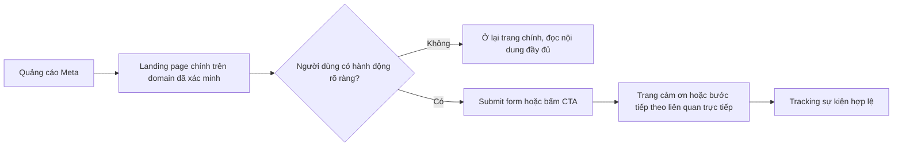

# Quy tắc setup LadiPage phù hợp với chính sách quảng cáo Facebook mới nhất

## Tóm tắt điều hành

Báo cáo này kết luận rằng với quảng cáo Meta dẫn về LadiPage, rủi ro bị từ chối không nằm ở một yếu tố đơn lẻ mà ở **sự nhất quán giữa nội dung quảng cáo, trang đích và cách thu thập dữ liệu**. Meta đánh giá cả nội dung text, hình ảnh, video, đối tượng nhắm chọn và trải nghiệm sau click; vì vậy một landing page “đẹp” nhưng có redirect bất ngờ, form xin quá nhiều dữ liệu, thiếu SSL, hoặc che nội dung bằng pop-up vẫn có thể bị coi là trải nghiệm kém hoặc hành vi gây hiểu nhầm. citeturn24search2turn24search8turn24search16

Về mặt chính sách, các điểm ảnh hưởng trực tiếp nhất đến landing page là: nội dung cấm hoặc bị hạn chế; quy định về quyền riêng tư và “personal attributes”; yêu cầu về trải nghiệm người dùng và tính liên quan của trang đích; quy định riêng cho ngành y tế, tài chính, nhà ở, việc làm, cờ bạc, dược phẩm; cùng các tiêu chuẩn chống lừa đảo, liên kết đánh lừa, né tránh kiểm duyệt và xâm phạm quyền sở hữu trí tuệ. Meta cũng có các yêu cầu tăng cường đối với quảng cáo thuộc **Special Ad Categories**, gồm tài chính, việc làm, nhà ở và các vấn đề xã hội/chính trị. citeturn8search3turn9search0turn10search5turn30search0turn30search3turn11search25turn28search1turn29search2

Về cấu hình LadiPage, cách an toàn nhất là dùng **tên miền riêng đã xác thực, bật SSL, xác minh domain với Meta bằng thẻ meta trong `head`, cài Pixel/CAPI đúng chỗ, hạn chế auto-redirect, chỉ bật pop-up sau tương tác rõ ràng, tối giản dữ liệu form, và bổ sung thông báo/đồng ý xử lý dữ liệu trước khi gửi form**. LadiPage hiện hỗ trợ trỏ domain, bật SSL, chèn Facebook Pixel, Facebook Conversion API, mã JavaScript/CSS, thẻ meta xác minh domain, lưu data về Email/API/Google Sheet và tính năng tự chuyển trang; đây đều là các tính năng hữu ích nhưng cũng là nguồn phát sinh vi phạm nếu cấu hình sai. citeturn16view1turn14search3turn14search12turn19search4turn20search9turn19search2turn17search0turn18search19turn18search8turn18search5

Phạm vi chi tiết về **phiên bản LadiPage** và **loại sản phẩm/quảng cáo cụ thể** là **không xác định** theo yêu cầu đầu bài, nên các khuyến nghị dưới đây được trình bày theo phương án tuân thủ chung, không ràng buộc vào một ngành hàng cụ thể; với sản phẩm y tế, tài chính, mỹ phẩm, dược, cờ bạc, tuyển dụng, bất động sản hoặc thông điệp xã hội/chính trị, cần rà soát thêm policy ngành tương ứng trước khi submit. citeturn9search0turn10search5turn30search0turn34search0turn34search1

## Khung chính sách Meta áp trực tiếp lên landing page

Meta yêu cầu nhà quảng cáo tuân thủ Advertising Standards để bảo vệ người dùng khỏi trải nghiệm kém. Về landing page, điều cốt lõi là **trang đích phải hoạt động bình thường, nội dung phải liên quan với quảng cáo, và không được đưa người dùng đến nội dung không liên quan hoặc bất ngờ**. Ngoài ra, checklist chính sách của Meta còn cảnh báo không dùng nội dung chất lượng thấp như ngôn ngữ giật gân, phóng đại hoặc cố tình giữ lại thông tin quan trọng để dụ click. citeturn24search3turn24search16turn27search3turn27search7

Với **nội dung cấm/hạn chế**, Meta cấm hoặc giới hạn mạnh các nhóm như thuốc và dược phẩm trực tuyến, cờ bạc trực tuyến, thuốc lá/nicotine, nội dung người lớn, nội dung gây sốc hoặc bạo lực quá mức, cũng như các mô hình lừa đảo hoặc gây hiểu nhầm. Đối với trang đích, điều này có nghĩa rằng ngay cả khi mẫu quảng cáo “hiền”, landing page vẫn có thể bị từ chối nếu bán hoặc mô tả các nhóm sản phẩm thuộc diện cấm/hạn chế, hoặc dùng cách trình bày lôi kéo, không minh bạch. citeturn34search0turn34search1turn34search4turn7search0turn11search3

Với **quyền riêng tư, thu thập dữ liệu và personal attributes**, Meta cấm quảng cáo chứa hoặc gợi ra thông tin riêng tư của người dùng và cấm nội dung “asserts or implies personal attributes”. Song song đó, pháp luật Việt Nam tại Nghị định 13/2023/NĐ-CP yêu cầu sự đồng ý phải rõ ràng, cụ thể; không được suy diễn sự im lặng là đồng ý; và phải thông báo trước về mục đích, loại dữ liệu, cách xử lý, bên liên quan và thời gian xử lý. Đặc biệt, dữ liệu dùng cho tiếp thị/giới thiệu sản phẩm quảng cáo chỉ được sử dụng khi có sự đồng ý của chủ thể dữ liệu. citeturn12search0turn8search3turn23view1turn23view3turn23view0

Với **ngành y tế, tài chính và nội dung nhạy cảm**, Meta đặt rào chắn cao hơn. Chính sách Health and Wellness cấm quảng cáo tạo cảm giác tự ti, tuyên bố về “cơ thể hoàn hảo”, hay ngụ ý kết quả không thực tế; quảng cáo cho sản phẩm/dịch vụ giảm cân, tăng cân, sức khỏe và mỹ phẩm có giới hạn nhắm mục tiêu theo độ tuổi. Chính sách tài chính yêu cầu cẩn trọng với lời mời chào và có quy định đặc biệt cho quảng cáo tài chính; đồng thời các quảng cáo về tài chính, việc làm, nhà ở và các vấn đề xã hội/chính trị phải khai báo **Special Ad Category** khi phù hợp. citeturn33search2turn26search3turn26search1turn10search5turn11search19turn30search0turn30search3turn9search3

Với **hình ảnh/video và quyền sở hữu trí tuệ**, Meta cấm nội dung sốc, giật gân, bạo lực quá mức, người lớn, hoặc vi phạm quyền của bên thứ ba. Vì vậy hình ảnh “before-after”, ảnh cắt ghép gây sốc, video cường điệu hóa công dụng, hoặc dùng logo/thương hiệu/ảnh có bản quyền mà không có quyền sử dụng đều là điểm rủi ro cao cho cả ad và landing page. citeturn7search0turn26search1turn11search25

Cuối cùng, Meta xem rất nghiêm **redirect, deceptive links, che giấu thông tin và né tránh kiểm duyệt**. Chính sách về Spam cấm deceptive links; Meta cũng cấm mọi nỗ lực né tránh quá trình review hoặc enforcement, và cấm các thực hành kinh doanh lừa dối/gây hiểu nhầm. Theo nghĩa thực thi, landing page không nên đổi đích ẩn, thay nội dung theo user-agent, hoặc che thông tin thật đến sau nhiều lớp click. citeturn28search1turn29search2turn11search3

## Cách cấu hình LadiPage để tuân thủ

Trong LadiPage, hạ tầng chuẩn nên bắt đầu từ **tên miền riêng + SSL + xác minh domain**. Help Center của LadiPage hướng dẫn trỏ domain riêng, xác thực tên miền, bật SSL rồi mới xuất bản; đồng thời LadiPage có tài liệu chèn thẻ meta vào phần `head` để xác minh quyền sở hữu tên miền với Facebook Business. Về mặt tuân thủ, tổ hợp này giúp reviewer thấy domain ổn định, bảo mật và nhất quán với tài sản doanh nghiệp trên Meta. citeturn16view1turn14search3turn19search4turn24search0turn24search4

Với **tracking và script**, nên ưu tiên cài Pixel theo ô chuyên dụng của LadiPage trước, sau đó mới bổ sung JavaScript/CSS tùy chỉnh nếu thật sự cần. LadiPage cho biết khi cài Facebook Pixel ID, hệ thống đã có sẵn các mã tiêu chuẩn như PageView và ViewContent; ngoài ra còn hỗ trợ Facebook Conversion API và khu vực chèn mã JavaScript/CSS. Cấu hình an toàn là: chỉ dùng script đo lường hợp pháp, không chèn cloaker, không đổi nội dung theo nguồn truy cập, không nhồi nhiều script pop-up/chat/replay làm chậm trang và gây trải nghiệm kém. citeturn14search12turn20search9turn19search2turn24search10turn24search8

Với **form và dữ liệu cá nhân**, nguyên tắc là chỉ xin đúng dữ liệu cần thiết cho mục đích chuyển đổi. LadiPage cho phép thêm trường dữ liệu, lưu data về Email, API và Google Sheet; vì vậy doanh nghiệp phải tự kiểm soát không biến form thành công cụ thu thập quá mức. Tối thiểu nên có checkbox đồng ý xử lý dữ liệu, link chính sách bảo mật, mô tả mục đích sử dụng dữ liệu và thông tin liên hệ của bên xử lý; đặc biệt không nên yêu cầu dữ liệu nhạy cảm hoặc thông tin tài chính nếu không thật sự cần và không có căn cứ pháp lý phù hợp. citeturn18search1turn18search8turn18search19turn18search5turn23view1turn23view3turn23view0

Với **redirect, pop-up và thank-you flow**, LadiPage có tính năng “Tự chuyển trang khi khách truy cập”; tuy nhiên đây là tính năng nên dùng rất thận trọng. Thiết lập hợp chuẩn là chỉ redirect sau hành động rõ ràng như submit form thành công hoặc bấm CTA, không redirect ngay khi mới vào trang, không redirect đa tầng sang domain khác, và không dùng pop-up che toàn bộ nội dung chính ở lần tải đầu tiên. Đây là khuyến nghị suy luận từ việc Meta cấm unexpected landing pages, deceptive links và trải nghiệm chất lượng thấp. citeturn17search0turn19search11turn24search16turn28search1turn27search3

Với **SEO, social meta, URL và mobile**, nên dùng tiêu đề/mô tả/social preview phản ánh đúng nội dung thật của trang; tránh URL quá dài, nhiều tham số khó đọc hoặc slug mang tính “bait”. LadiPage có tài liệu riêng cho mô tả SEO & Social, sửa lỗi chia sẻ Facebook/Zalo, và hỗ trợ thiết kế tối ưu nhiều thiết bị. Về chính sách, việc giữ preview và nội dung thật thống nhất giúp giảm rủi ro bị xem là gây hiểu nhầm hoặc nội dung không liên quan sau click. citeturn17search11turn20search7turn13search0turn17search8turn24search16

## Lỗi phổ biến khi dùng LadiPage khiến quảng cáo bị từ chối

Lỗi phổ biến nhất là **auto-redirect quá sớm**. Tình huống điển hình: quảng cáo dẫn đến `abc.com/uu-dai`, nhưng LadiPage tự chuyển sang domain affiliate, app chat hoặc trang thanh toán khác sau 1–2 giây. Dù tính năng redirect được LadiPage hỗ trợ, Meta có thể coi đây là unexpected landing page hoặc deceptive link nếu người dùng không chủ động hành động trước. citeturn17search0turn19search11turn24search16turn28search1

Lỗi thứ hai là **form quá tham dữ liệu**. Ví dụ thực tế hay gặp là form lead xin đồng thời họ tên, số điện thoại, email, địa chỉ chi tiết, ngày sinh, nghề nghiệp, tình trạng sức khỏe hoặc thông tin tài chính trong một offer đơn giản như ebook hoặc tư vấn miễn phí. Điều này va chạm đồng thời với policy privacy/personal attributes của Meta và chuẩn đồng ý–thông báo theo Nghị định 13/2023/NĐ-CP. citeturn12search0turn23view1turn23view3

Lỗi thứ ba là **dùng hình ảnh/trước–sau và ngôn ngữ công kích nỗi sợ** cho sản phẩm sức khỏe, thẩm mỹ, giảm cân. Meta nêu rõ ví dụ ảnh “before-after” cho làm trắng da là không tuân thủ, đồng thời cấm nội dung tạo cảm giác tự ti hoặc ngụ ý kết quả phi thực tế. Nếu trang LadiPage lặp lại đúng kiểu hình ảnh/copy này, quảng cáo thường bị từ chối dù ad text đã sửa. citeturn26search1turn33search2turn26search4

Lỗi thứ tư là **thiếu tín hiệu tin cậy kỹ thuật**: không bật SSL, dùng subdomain tạm, không xác minh domain với Meta, hoặc dùng nhiều script tùy chỉnh khiến trang tải chậm/lỗi hiển thị. LadiPage đã có quy trình domain–SSL–publish và quy trình gắn meta verification cho Facebook Business; bỏ qua các bước này làm tăng khả năng reviewer đánh giá trang kém chất lượng hoặc không đáng tin. citeturn16view1turn14search3turn19search4turn24search24

Lỗi thứ năm là **nội dung landing page không khớp ad**. Ví dụ: ad nói “nhận báo giá bảo hiểm”, nhưng landing page đầu tiên lại là mini game, form “đăng ký webinar”, hoặc trang chỉ có vài block chung chung rồi ép để lại số điện thoại mới lộ thông tin thật. Meta coi việc giữ lại thông tin quan trọng để dụ click là low-quality content, và việc đưa người dùng sang nội dung không liên quan là unacceptable business practice. citeturn27search3turn24search16turn11search3

Lỗi thứ sáu là **xâm phạm quyền sở hữu trí tuệ**: dùng ảnh mạng, logo nhãn hàng, video KOL, hoặc testimonial chưa được phép trong banner và trên trang LadiPage. Với sản phẩm tài chính, mỹ phẩm, công nghệ, đồng hồ, thời trang, lỗi này xuất hiện rất thường xuyên và Meta có chính sách riêng cấm third-party infringement. citeturn11search25turn8search10

## Checklist trước khi submit quảng cáo

| Hạng mục | Cần kiểm tra | Đạt/Chưa | Nguồn |
|---|---|---:|---|
| Domain | Dùng domain riêng, không domain tạm; domain đã xác thực trong LadiPage | ☐ | citeturn16view1 |
| SSL | HTTPS hoạt động trên toàn bộ trang đích | ☐ | citeturn14search3turn16view1 |
| Domain với Meta | Đã xác minh domain bằng meta tag hoặc phương thức Meta chấp nhận | ☐ | citeturn19search4turn24search0 |
| Nội dung ad–page | Tiêu đề, offer, CTA và trang đích khớp nhau; không giữ lại thông tin quan trọng để dụ click | ☐ | citeturn27search3turn24search16 |
| Redirect | Không auto-redirect ngay khi load; không đổi sang domain lạ nếu chưa có hành động người dùng | ☐ | citeturn19search11turn28search1turn24search16 |
| Form | Chỉ xin dữ liệu cần thiết; có checkbox đồng ý và link chính sách bảo mật | ☐ | citeturn18search1turn23view1turn23view3 |
| Tracking | Pixel/CAPI gắn đúng; không chèn script cloaking hoặc script gây lỗi trang | ☐ | citeturn14search12turn20search9turn19search2 |
| Hình ảnh/video | Không “before-after”, không gây sốc, không người lớn, không tuyên bố quá mức | ☐ | citeturn26search1turn7search0turn33search2 |
| IP | Có quyền sử dụng ảnh, logo, nhạc, video, testimonial | ☐ | citeturn11search25 |
| Mobile | Kiểm tra hiển thị và tốc độ trên mobile; pop-up không che nội dung chính | ☐ | citeturn13search0turn17search8turn24search8 |
| Ngành nhạy cảm | Nếu là tài chính/việc làm/nhà ở/xã hội-chính trị thì đã chọn Special Ad Category; nếu là y tế/dược/cờ bạc thì đã rà soát policy ngành | ☐ | citeturn30search0turn9search0turn34search0turn34search1 |

## Mẫu giải thích khi kháng nghị từ chối quảng cáo

Bạn có thể dùng mẫu dưới đây và thay thông tin trong ngoặc vuông:

> Kính gửi đội ngũ Meta,  
> Chúng tôi đề nghị xem xét lại quảng cáo [ID quảng cáo] vì chúng tôi đã rà soát và điều chỉnh để phù hợp với Meta Advertising Standards.  
>  
> Cụ thể, chúng tôi đã:  
> – bảo đảm nội dung quảng cáo và landing page nhất quán về offer, CTA và thông tin sản phẩm;  
> – loại bỏ mọi yếu tố có thể gây hiểu nhầm, redirect bất ngờ hoặc nội dung chất lượng thấp;  
> – cập nhật trang đích trên domain đã xác minh, bật SSL và kiểm tra khả năng truy cập bình thường;  
> – rà soát hình ảnh/video để bảo đảm không vi phạm quy định về nội dung nhạy cảm, before-after hoặc quyền sở hữu trí tuệ;  
> – rà soát form thu thập dữ liệu, chỉ giữ lại dữ liệu cần thiết và bổ sung thông báo/đồng ý phù hợp.  
>  
> Nếu quảng cáo thuộc danh mục đặc biệt, chúng tôi đã chọn đúng Special Ad Category tương ứng.  
> Kính mong Meta xem xét lại sau khi các thay đổi trên đã được áp dụng tại [URL landing page].  
> Trân trọng. citeturn24search2turn24search16turn30search0turn12search0turn23view3

Về mặt chiến thuật, nội dung kháng nghị nên **mô tả thay đổi cụ thể**, không tranh luận cảm tính. Meta cho biết hệ thống review kiểm tra vi phạm Advertising Standards và Meta cũng có tài liệu về các ví dụ vi phạm phổ biến; vì vậy thư kháng nghị hiệu quả nhất là chứng minh bạn đã sửa đúng điểm rủi ro: privacy/personal attributes, low-quality content, deceptive experience, special ad category hoặc IP. citeturn24search2turn25search0turn24search8turn25search6

## Kết luận áp dụng nhanh

Nếu phải rút gọn thành một quy tắc vận hành: **đừng dùng LadiPage như công cụ “lách review”; hãy dùng nó như một trang đích minh bạch, ổn định, có consent rõ ràng, và khớp hoàn toàn với lời hứa trong quảng cáo**. Phần lớn lỗi bị từ chối phát sinh khi doanh nghiệp lạm dụng chính các tính năng mạnh của LadiPage — redirect, script tùy chỉnh, popup, form phức tạp, tracking dày đặc — theo hướng làm reviewer và người dùng thấy trang không minh bạch. citeturn19search2turn17search0turn24search16turn29search2

Trong bối cảnh hiện tại, cấu hình “an toàn mặc định” nên là: **domain riêng đã xác minh, SSL bật, Pixel/CAPI chuẩn, không auto-redirect, form tối giản có consent, preview SEO/Social trung thực, mobile-first, và rà soát policy ngành trước khi submit**. Với bộ setup này, LadiPage hoàn toàn có thể chạy Meta Ads bền vững hơn và giảm đáng kể tỷ lệ bị từ chối hoặc bị hạn chế tài khoản. citeturn16view1turn14search3turn14search12turn20search9turn19search4turn30search0turn24search8